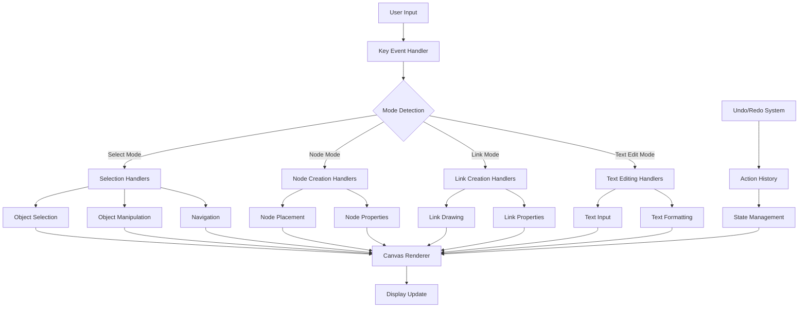
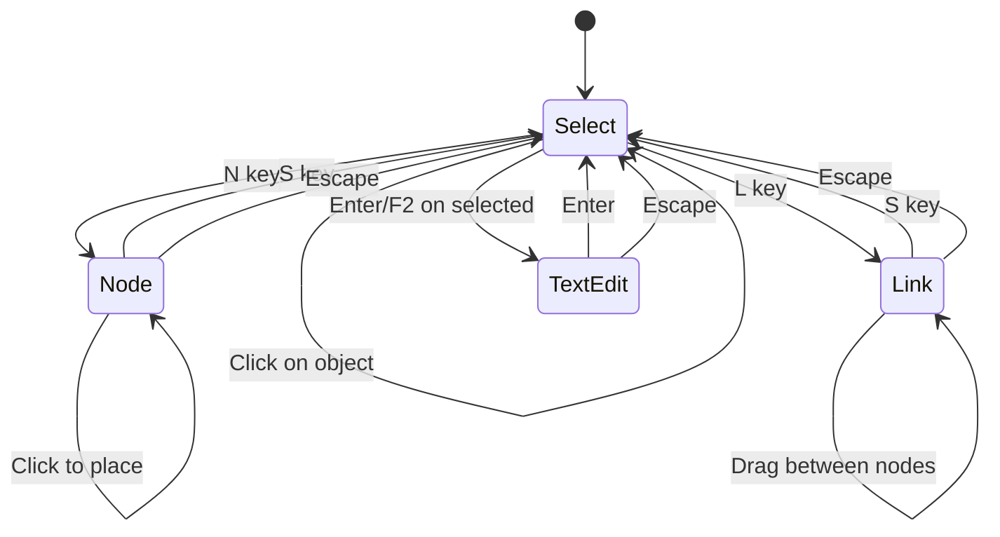
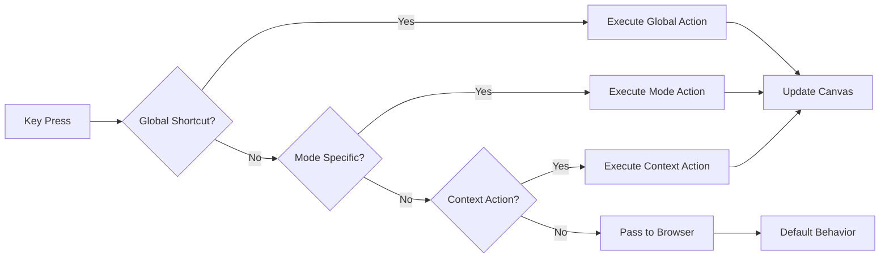

# Keybind System Architecture

## System Overview



## Mode State Machine



## Keybind Priority System



## Implementation Components

### 1. Core Keybind Manager
```javascript
class KeybindManager {
    constructor() {
        this.currentMode = 'select';
        this.keybinds = new Map();
        this.globalKeybinds = new Map();
        this.modeKeybinds = new Map();
        this.contextKeybinds = new Map();
    }
    
    registerKeybind(keybind) {
        // Register keybind with appropriate context
    }
    
    handleKeyEvent(event) {
        // Route key event to correct handler
    }
    
    setMode(mode) {
        // Switch active mode
    }
}
```

### 2. Mode System
```javascript
class ModeManager {
    constructor() {
        this.modes = {
            select: new SelectMode(),
            node: new NodeMode(),
            link: new LinkMode(),
            textEdit: new TextEditMode()
        };
        this.currentMode = null;
    }
    
    switchMode(modeName) {
        // Clean transition between modes
    }
}
```

### 3. Action History System
```javascript
class ActionHistory {
    constructor() {
        this.undoStack = [];
        this.redoStack = [];
        this.maxHistorySize = 50;
    }
    
    executeAction(action) {
        // Execute and record action
    }
    
    undo() {
        // Undo last action
    }
    
    redo() {
        // Redo last undone action
    }
}
```

## User Experience Flow

### New User Onboarding
1. **First Load**: Show welcome overlay with basic controls
2. **Interactive Tutorial**: Guided tour of key features
3. **Progressive Disclosure**: Introduce advanced shortcuts gradually
4. **Contextual Hints**: Show relevant shortcuts based on user actions

### Expert User Workflow
1. **Quick Mode Switching**: Rapid tool changes via keyboard
2. **Keyboard-First**: Minimal mouse usage for common operations
3. **Efficient Navigation**: Pan and zoom without leaving keyboard
4. **Bulk Operations**: Select all, group, and manipulate multiple objects

## Educational Features Integration

### Learning Progression
- **Level 1**: Basic node/link creation and selection
- **Level 2**: Text editing and basic manipulation
- **Level 3**: Advanced operations and shortcuts
- **Level 4**: Export and sharing capabilities

### Concept Reinforcement
- **Visual Feedback**: Highlight FSM concepts during use
- **Terminology**: Use proper computer science terms
- **Examples**: Provide common FSM patterns
- **Validation**: Check for common mistakes

## Performance Considerations

### Event Handling
- **Debouncing**: Prevent rapid-fire key events
- **Passive Listeners**: Use passive event listeners where possible
- **Event Pooling**: Reuse event objects to reduce garbage collection

### Rendering Optimization
- **Dirty Rectangle**: Only redraw changed areas
- **Level of Detail**: Simplify rendering during pan/zoom
- **Offscreen Canvas**: Pre-render complex elements

### Memory Management
- **Action History**: Limit undo stack size
- **Object Pooling**: Reuse objects for frequent operations
- **Weak References**: Use weak maps for temporary data

## Accessibility Features

### Keyboard Navigation
- **Tab Order**: Logical navigation through UI elements
- **Focus Indicators**: Clear visual feedback for focused elements
- **Screen Reader Support**: ARIA labels and announcements

### Visual Accessibility
- **High Contrast Mode**: Alternative color schemes
- **Adjustable Text Sizes**: Scalable UI elements
- **Color Blind Support**: Patterns and shapes in addition to color

### Motor Accessibility
- **Adjustable Timing**: Configurable animation speeds
- **Large Hit Targets**: Easier targeting with mouse/pointer
- **Alternative Input**: Support for various input devices

## Testing Strategy

### Unit Testing
- **Keybind Registration**: Test keybind registration and execution
- **Mode Switching**: Verify mode transitions work correctly
- **Action History**: Test undo/redo functionality

### Integration Testing
- **User Workflows**: Test complete user scenarios
- **Cross-browser**: Verify compatibility across browsers
- **Performance**: Test with large diagrams

### User Testing
- **Educational Settings**: Test with actual students/teachers
- **Accessibility**: Test with users with disabilities
- **Expert Users**: Test efficiency for power users

## Deployment Considerations

### Feature Flags
- **Progressive Rollout**: Enable features gradually
- **A/B Testing**: Compare different keybind schemes
- **User Preferences**: Allow customization of keybinds

### Analytics
- **Usage Tracking**: Monitor which features are used
- **Performance Metrics**: Track rendering and interaction performance
- **Error Reporting**: Collect and analyze errors

### Documentation
- **Interactive Help**: Built-in tutorial system
- **Video Guides**: Short demonstration videos
- **Printable Reference**: PDF quick reference card